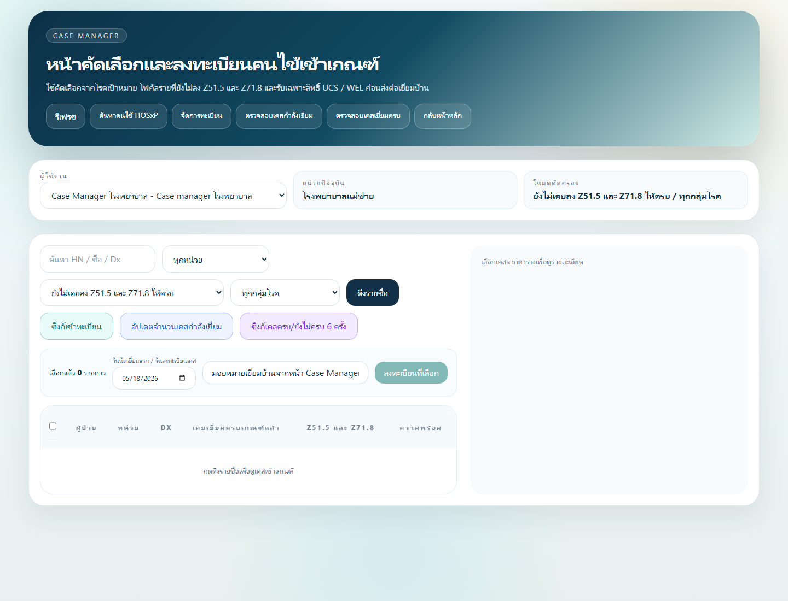
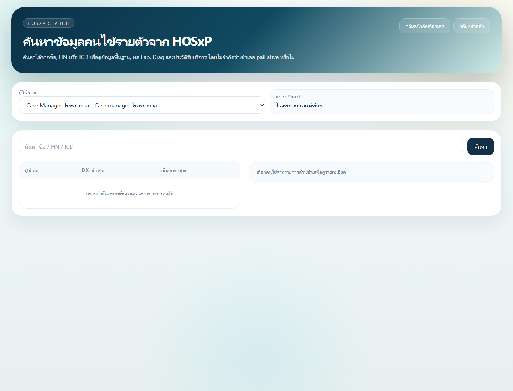
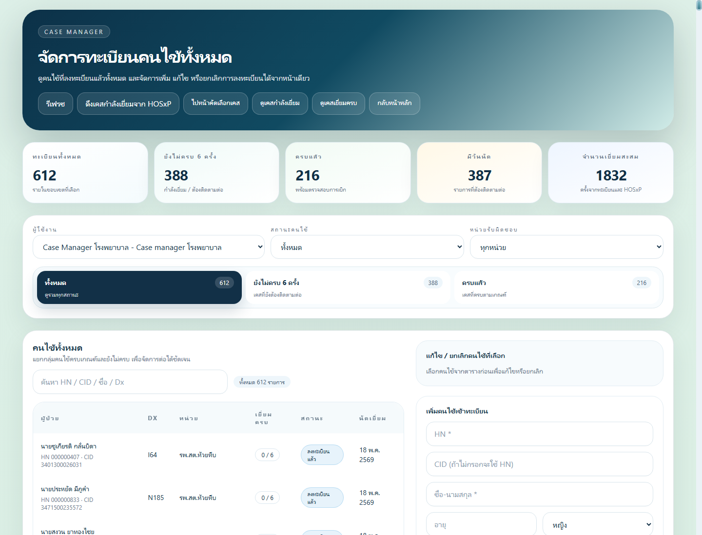
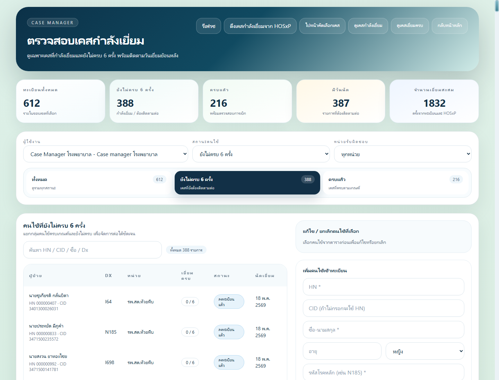
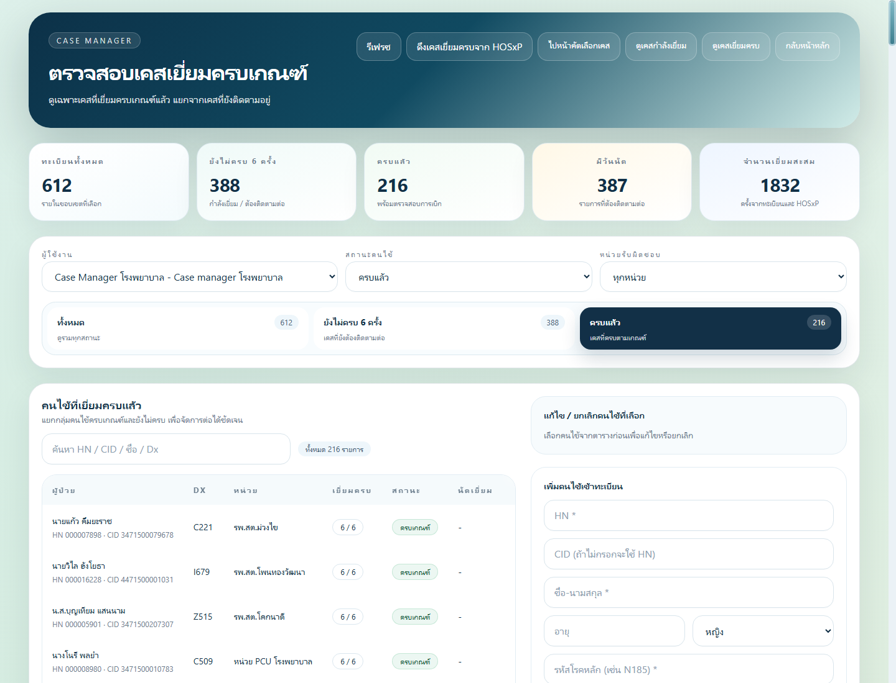

# คู่มือการใช้งานสำหรับ Case Manager

คู่มือนี้ใช้สำหรับ Case Manager โรงพยาบาลในระบบ Palliative Home Visit เพื่อคัดเลือกคนไข้จาก HOSXP ลงทะเบียนเข้าระบบ มอบหมายหน่วย รพ.สต./PCU ติดตามเคสที่กำลังเยี่ยม ตรวจเคสครบเกณฑ์ และดูความครบถ้วนของข้อมูลก่อนใช้ต่อในงานรายงาน/ห้องบัตร/ผู้บริหาร

## 1. ภาพรวมบทบาท Case Manager

Case Manager เป็นผู้คุมภาพรวมของเคสทั้งเครือข่าย ไม่ใช่ผู้บันทึก visit แทนพยาบาลหน่วยเป็นหลัก งานสำคัญคือทำให้คนไข้ถูกคัดเข้าระบบอย่างถูกต้อง อยู่กับหน่วยที่รับผิดชอบจริง และมีข้อมูลครบพอให้หน่วยลงเยี่ยมต่อได้

สิ่งที่ Case Manager ทำได้:

- ดึงรายชื่อคนไข้เข้าเกณฑ์จาก HOSXP
- ตรวจรายชื่อแบบรายตัวจาก HOSXP ด้วยชื่อ, HN หรือ CID
- ลงทะเบียนคนไข้เข้าระบบ Palliative
- มอบหมายหน่วยรับผิดชอบ
- แก้ไขข้อมูลทะเบียน เช่น หน่วย, เบอร์โทร, นัดถัดไป และหมายเหตุ
- ตรวจเคสที่ยังเยี่ยมไม่ครบ 6 ครั้ง
- ตรวจเคสที่ครบเกณฑ์แล้ว
- ซิงก์เคสกำลังเยี่ยม/ครบเกณฑ์จาก HOSXP
- อนุมัติผู้ใช้และช่วยจัดการผู้ใช้ตามสิทธิ์ที่ระบบกำหนด

## 2. เข้าหน้า Case Manager

หลังเข้าสู่ระบบด้วยบัญชีบทบาท `Case Manager โรงพยาบาล` ให้เข้าเมนู `ไปหน้า Case Manager`

หน้าหลักจะแสดงเมนูสำคัญ:

- `รีเฟรช`
- `ค้นหาคนไข้ HOSxP`
- `จัดการทะเบียน`
- `ตรวจสอบเคสกำลังเยี่ยม`
- `ตรวจสอบเคสเยี่ยมครบ`
- `กลับหน้าหลัก`



## 3. ดึงรายชื่อคนไข้เข้าเกณฑ์จาก HOSXP

ใช้หน้า `หน้าคัดเลือกและลงทะเบียนคนไข้เข้าเกณฑ์` เพื่อค้นหาเคสจากฐาน HOSXP ที่เข้าเงื่อนไขโรคเป้าหมายหรือรหัสบริการที่เกี่ยวข้อง

ขั้นตอนที่แนะนำ:

1. เลือกผู้ใช้งาน Case Manager ให้ถูกต้อง
2. เลือกหน่วยปัจจุบัน หรือเลือกทุกหน่วยเมื่อต้องการดูภาพรวม
3. เลือกโหมดคัดกรอง เช่น ยังไม่เคยลง Z51.5/Z71.8 หรือทุกกลุ่มโรค
4. เลือกกลุ่มโรคเมื่อต้องการจำกัดรายการ
5. กด `ดึงรายชื่อ`
6. คลิกเลือกคนไข้ที่ต้องการตรวจรายละเอียด
7. ตรวจประวัติ visit และความพร้อมก่อนลงทะเบียน
8. เลือกวันที่เริ่มเยี่ยมหรือวันลงทะเบียนเคส
9. ใส่หมายเหตุการมอบหมาย
10. กด `ลงทะเบียนที่เลือก`

ข้อควรตรวจทุกครั้งก่อนลงทะเบียน:

- HN/CID ถูกคน
- หน่วยตามพื้นที่ถูกต้อง
- โรคหลักเข้าเกณฑ์จริง
- คนไข้ไม่ได้อยู่ในรายการยกเว้นหรือระบบอื่นที่กำหนดแล้ว
- หากมีประวัติครบเกณฑ์แล้ว ให้ตรวจให้แน่ใจก่อนลงทะเบียนซ้ำ

## 4. ค้นหาคนไข้รายตัวจาก HOSXP

ใช้หน้า `ค้นหาข้อมูลคนไข้รายตัวจาก HOSXP` เมื่อต้องตรวจคนไข้เฉพาะราย เช่น ญาติแจ้งชื่อมา, หน่วยถามสถานะ, หรือพบว่าไม่อยู่ในรายการคัดกรองอัตโนมัติ



วิธีใช้งาน:

1. พิมพ์ชื่อ, HN หรือ CID
2. กด `ค้นหา`
3. เลือกรายการคนไข้ที่ตรงกัน
4. ตรวจข้อมูลพื้นฐาน, Dx ล่าสุด, Lab, Diag และประวัติบริการ
5. หากเข้าเกณฑ์ ให้กลับไปลงทะเบียนในหน้า Case Manager หรือจัดการทะเบียนตาม workflow ของหน่วย

แนวทางป้องกันการเลือกผิดคน:

- ใช้ HN/CID เป็นหลักเมื่อมีชื่อซ้ำ
- ตรวจวันเกิดและที่อยู่ประกอบ
- ตรวจหน่วยรับผิดชอบตามกติกาพื้นที่ล่าสุด

## 5. จัดการทะเบียนคนไข้

หน้า `จัดการทะเบียนคนไข้` ใช้ดูและแก้ไขข้อมูลทะเบียนของคนไข้ที่อยู่ในระบบแล้ว



งานที่ทำในหน้านี้:

- ค้นหาด้วย HN, CID, ชื่อ หรือ Dx
- กรองตามสถานะ เช่น กำลังติดตาม, ครบเกณฑ์, ยกเลิก, เสียชีวิต
- กรองตามหน่วย รพ.สต./PCU
- เลือกคนไข้เพื่อดูรายละเอียด
- เปลี่ยนหน่วยรับผิดชอบเมื่อพบว่าพื้นที่ไม่ถูกต้อง
- แก้ไขนัดถัดไป, เบอร์โทร, LINE ID และหมายเหตุ
- ยกเลิกทะเบียนพร้อมระบุเหตุผล
- เพิ่มคนไข้เข้าทะเบียนด้วยมือเมื่อจำเป็น

หลักการแก้ไขทะเบียน:

- การเปลี่ยนหน่วยต้องอิงข้อมูลที่อยู่/เขตรับผิดชอบล่าสุด
- หลีกเลี่ยงการแก้ไขย้อนหลังโดยไม่มีหมายเหตุ
- หากยกเลิกเพราะอยู่ระบบอื่น เช่น LCT ให้ระบุเหตุผลให้ชัด
- หากคนไข้เสียชีวิตหรือย้ายพื้นที่ ให้เปลี่ยนสถานะตามจริง ไม่ลบข้อมูล

## 6. ตรวจสอบเคสกำลังเยี่ยม

หน้า `ตรวจสอบเคสกำลังเยี่ยม` ใช้ติดตามคนไข้ที่ยังไม่ครบ 6 ครั้ง หรือยังต้องติดตามต่อ



สิ่งที่ควรตรวจ:

- จำนวนทะเบียนทั้งหมดในขอบเขตที่เลือก
- จำนวนเคสยังไม่ครบ 6 ครั้ง
- จำนวนเคสครบแล้ว
- จำนวนเคสมีวันนัด
- รายการคนไข้ในแต่ละหน่วย
- จำนวน visit ที่บันทึกแล้ว
- สถานะและนัดเยี่ยมถัดไป

แนวทางติดตาม:

- ใช้ filter หน่วยเพื่อดูว่า รพ.สต./PCU ใดมีเคสค้างมาก
- ตรวจเคสที่ไม่มีนัดถัดไป
- ตรวจเคสที่มี visit น้อยกว่ารอบที่ควรมี
- ใช้หมายเหตุเพื่อแจ้งหน่วยเมื่อข้อมูลยังไม่ครบ
- ซิงก์จาก HOSXP เมื่อมีข้อมูลใหม่จากระบบต้นทาง

## 7. ตรวจสอบเคสเยี่ยมครบเกณฑ์

หน้า `ตรวจสอบเคสเยี่ยมครบ` ใช้ดูคนไข้ที่ครบเงื่อนไขติดตามแล้ว เพื่อเตรียมตรวจความครบถ้วนของข้อมูลและปิดงานตามเกณฑ์



ควรตรวจรายการต่อไปนี้ก่อนถือว่าเคสสมบูรณ์:

- จำนวน visit ครบตามเกณฑ์
- มี Authen code เมื่อจำเป็น
- มีรูปภาพแนบครบตามเงื่อนไขงาน
- มีข้อมูลประเมินคลินิกที่สำคัญ
- มีหมายเหตุสรุปอาการและแผนดูแล
- หากมี ACP/LW ต้องมี PDF และดาวน์โหลดได้
- สถานะคนไข้ถูกต้อง เช่น ครบเกณฑ์, เสียชีวิต, ยกเลิก

## 8. การดูข้อมูลที่ส่งในวันนั้น

Case Manager ควรใช้หน้า `ข้อมูลส่งรายวัน` หรือเมนูรายงานรายวันเมื่อต้องตรวจรายการ visit ที่หน่วยส่งมาในวันที่เลือก

งานที่ควรทำ:

- เลือกวันที่ที่ต้องการตรวจ โดยค่าเริ่มต้นควรเป็นวันปัจจุบัน
- ตรวจว่ามีรายการจากทุกหน่วยที่คาดว่าจะส่งงาน
- ตรวจ HN/CID/ชื่อคนไข้ว่าไม่ผิดคน
- ตรวจว่ารูปภาพแนบเปิดได้
- ตรวจ Authen code และข้อมูลประเมินสำคัญ
- หากพบข้อผิดพลาด ให้แก้ไขตามสิทธิ์หรือแจ้งหน่วยแก้ในวันเดียวกัน

ข้อมูลที่มักต้องแก้ในวันเดียวกัน:

- วันที่เยี่ยมผิด
- Authen code ตกหล่น
- รูปภาพผิดคนหรือยังไม่แนบ
- อาการติดตามสั้นเกินไป
- PPS/ESAS/ข้อมูลคลินิกยังไม่ครบ
- เลือกหน่วยหรือคนไข้ผิด

## 9. การประสานงานกับพยาบาลหน่วย

เมื่อพบข้อมูลไม่ครบ ควรแจ้งหน่วยด้วยข้อมูลที่ชัดเจน เช่น HN, ชื่อ, วันที่เยี่ยม และรายการที่ต้องแก้

ตัวอย่างข้อความแจ้งหน่วย:

```text
รบกวนตรวจ visit วันที่ 18/05/2569
HN: 000123456 ชื่อ: ...
ประเด็น: ยังไม่มีรูปติดตามอาการ และยังไม่ได้กรอก PPS
ขอให้แก้ไขภายในวันนี้เพื่อให้ข้อมูลรายวันสมบูรณ์
```

## 10. Checklist ประจำวันของ Case Manager

- ตรวจเคสใหม่จาก HOSXP และลงทะเบียนเฉพาะรายที่เข้าเกณฑ์
- ตรวจว่าคนไข้ถูกมอบหมายหน่วยถูกต้อง
- ตรวจเคสกำลังเยี่ยมที่ไม่มีนัดถัดไป
- ตรวจข้อมูลส่งรายวันของทุกหน่วย
- ติดตาม visit ที่ข้อมูลไม่ครบ
- ตรวจเคสครบเกณฑ์และปรับสถานะเมื่อเหมาะสม
- ตรวจคำขอสมัครสมาชิก/ผู้ใช้ที่ต้องอนุมัติ
- บันทึกหมายเหตุในเคสที่มีปัญหาหรือมีการแก้ไขสำคัญ

## 11. ข้อผิดพลาดที่พบบ่อยและวิธีป้องกัน

| ปัญหา | วิธีป้องกัน |
| --- | --- |
| ลงทะเบียนผิดคน | ตรวจ HN/CID และหน่วยก่อนกดลงทะเบียน |
| คนไข้ไปอยู่ผิด รพ.สต. | ตรวจที่อยู่และกติกาพื้นที่ล่าสุดก่อนมอบหมาย |
| มีเคสที่อยู่ระบบอื่นแล้วยังค้างในทะเบียน | ใส่เหตุผลและยกเลิก/เอาออกตามแนวทางที่กำหนด |
| เคสครบแล้วแต่ยังอยู่กำลังเยี่ยม | ตรวจ visit count และปรับสถานะให้ถูก |
| ข้อมูลรายวันไม่ครบ | ตรวจทุกวันและแจ้งหน่วยแก้ในวันเดียวกัน |
| รูปภาพเปิดไม่ได้ | แจ้งหน่วยแนบใหม่หรือแก้ไข visit ทันที |
| ผู้ใช้เลือก role ผิด | Admin/Case Manager ตรวจบทบาทและหน่วยก่อนอนุมัติ |

## 12. สรุปมาตรฐานการทำงาน

Case Manager ควรทำให้ข้อมูลทุกเคสตอบคำถามได้ 5 ข้อ:

1. คนไข้รายนี้เข้าเกณฑ์เพราะอะไร
2. อยู่ในความรับผิดชอบของหน่วยใด
3. เยี่ยมไปแล้วกี่ครั้ง และยังเหลือกี่ครั้ง
4. ข้อมูลที่ส่งมาวันนี้ครบพอใช้ต่อหรือไม่
5. เคสควรติดตามต่อ ครบเกณฑ์ ยกเลิก หรือส่งต่อระบบอื่น

คู่มือนี้ควรทบทวนเมื่อมีการปรับเกณฑ์, ปรับ mapping พื้นที่ รพ.สต., เพิ่ม field การเยี่ยม หรือเปลี่ยน workflow รายงานรายวัน
